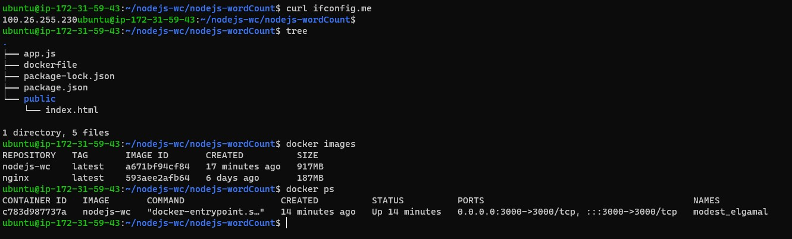
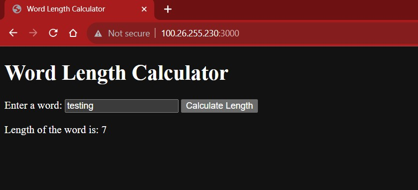

# Node.js Word Count Application





This is a simple Node.js application that counts the number of words in an input string. The application runs in a Docker container for easy deployment.

## Prerequisites

Before you get started, make sure you have the following prerequisites:

- [Docker](https://www.docker.com/get-started) installed on your machine.
- [Node.js](https://nodejs.org/) installed on your machine.

## Getting Started

### Clone the Repository

Clone this Git repository to your local machine:

```bash
git clone https://github.com/ParnavDagar/nodejs-wordCount.git
cd nodejs-wordCount

```

### Build and Run the Docker Container:
Use the following commands to build a Docker image for the application and run a container based on it:

```bash
docker build -t nodejs-wordcount-app .
docker run -p 3000:3000 nodejs-wordcount-app

```
Your Node.js application is now running in a Docker container. You can access it by opening a web browser and navigating to http://localhost:3000.

